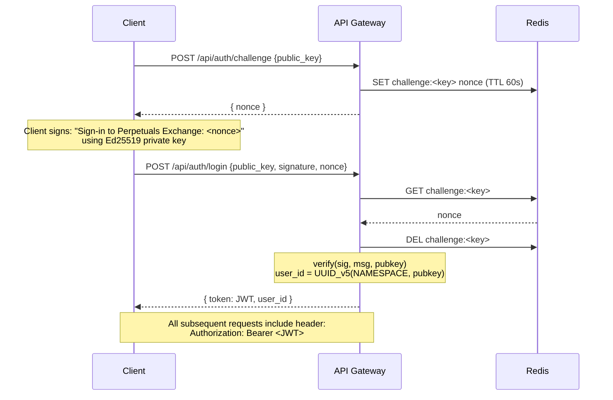
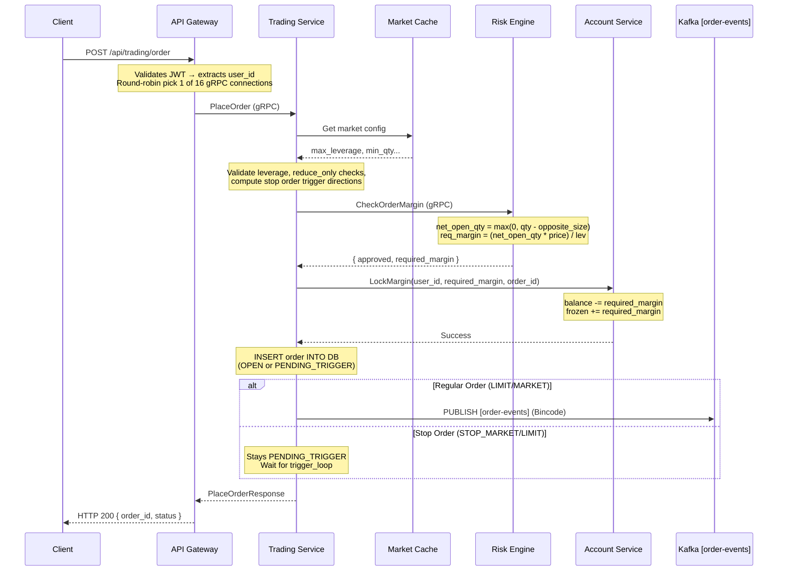
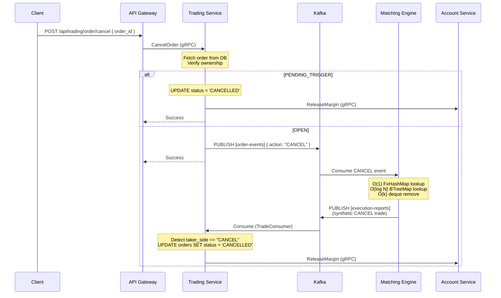
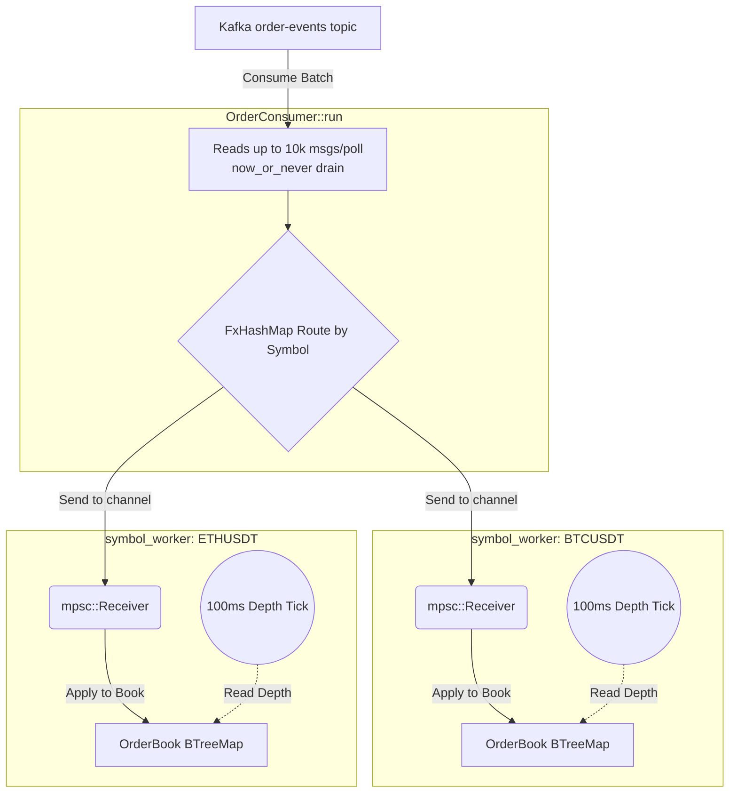
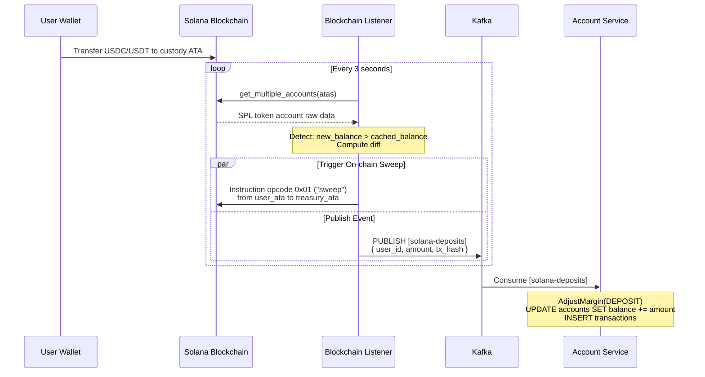
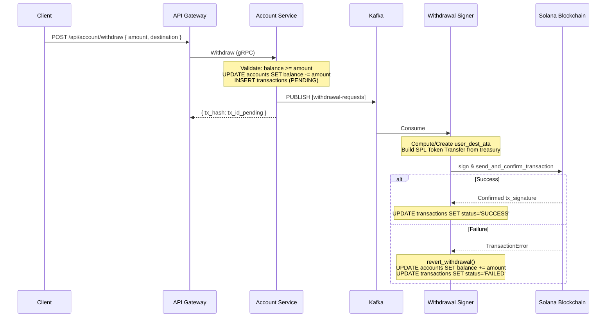
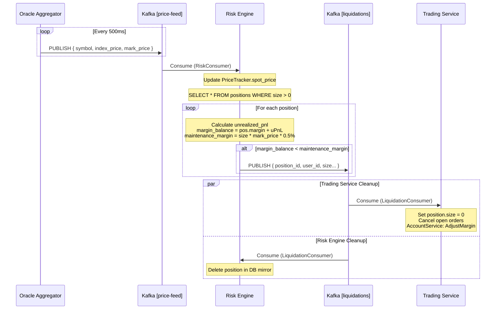
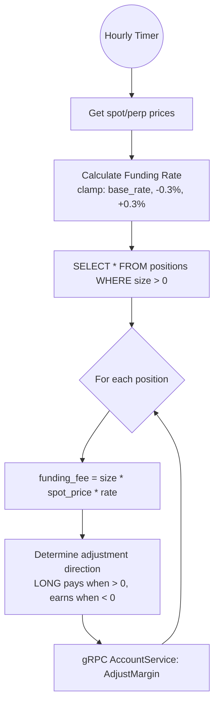
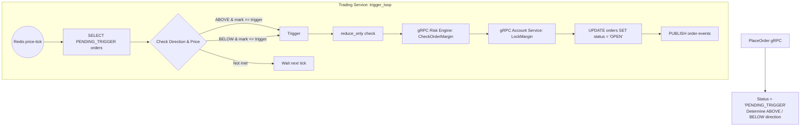
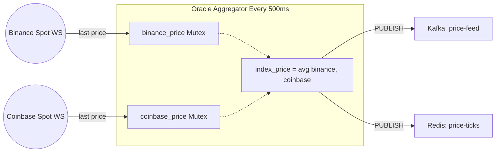

#  Perps Exchange — High-Performance Perpetual Futures Exchange

> A production-grade, fully on-chain settled **Perpetual Futures DEX** built entirely in **Rust** — sub-millisecond matching engine, Solana-based custody, real-time WebSocket/WebTransport streaming, and a fully event-driven microservices architecture.

---

## Table of Contents

1. [Overview](#overview)
2. [Architecture Diagram](#architecture-diagram)
3. [Service Catalog](#service-catalog)
4. [Technology Stack](#technology-stack)
5. [Inter-Service Communication](#inter-service-communication)
6. [Kafka Topics](#kafka-topics)
7. [gRPC Service Definitions](#grpc-service-definitions)
8. [Client Connectivity](#client-connectivity)
9. [Authentication Flow](#authentication-flow)
10. [Order Placement Flow](#order-placement-flow)
11. [Order Cancellation Flow](#order-cancellation-flow)
12. [Matching Engine Deep Dive](#matching-engine-deep-dive)
13. [Deposit Flow (Solana)](#deposit-flow-solana-on-chain)
14. [Withdrawal Flow (Solana)](#withdrawal-flow-solana-on-chain)
15. [Liquidation Flow](#liquidation-flow)
16. [Funding Rate Settlement](#funding-rate-settlement)
17. [Stop / Conditional Orders](#stop--conditional-orders)
18. [Price Oracle](#price-oracle--mark-price)
19. [Database Design](#database-design)
20. [Observability Stack](#observability-stack)
21. [Scaling Guide](#scaling-guide)
22. [Running Locally](#running-locally)
23. [Project Structure](#project-structure)

---

## Overview

**Perps Exchange** is a perpetual futures trading platform where:

- Users deposit **USDC/USDT** to a **Solana smart contract** (Program ID: `HYcoTHLzYZiE5ok6cGoXBAbZSafxuf7aX4EGkQnFHHsM`) — funds sweep into a treasury ATA; balances tracked in PostgreSQL
- Orders flow: `REST → gRPC → Kafka [order-events] → Matching Engine → Kafka [execution-reports] → Trading Service + API Gateway (WS push)`
- Withdrawals trigger on-chain **SPL token transfers** from the treasury to user wallets
- **Risk Engine** monitors every position on each price tick and liquidates positions breaching MMR = 0.5%
- **Oracle Aggregator** derives mark/index price from live Binance + Coinbase spot feeds (average, every 500ms)
- **Funding Rate** settles hourly: `clamp((perp − spot) / spot, −0.3%, +0.3%)`

---

## Architecture Diagram

```mermaid
flowchart TD
    Client[Client Browser / Mobile / TUI]

    subgraph ObservabilityLayer [Observability Layer]
        direction TB
        Grafana[Grafana Dashboards]
        Prometheus[Prometheus]
        Jaeger[Jaeger Tracing]
        
        Grafana -->|Query| Prometheus
    end

    subgraph MicroservicesLayer [Microservices Layer]
        direction TB
        API[API Gateway]
        TS[Trading Service]
        AS[Account Service]
        RE[Risk Engine]
        ME{Matching Engine}
        
        API -->|gRPC| TS
        API -->|gRPC| AS
        TS <-->|gRPC| RE
        TS <-->|gRPC| AS
    end

    subgraph DataLayer [Data & Messaging Layer]
        direction LR
        PG[(PostgreSQL)]
        Kafka[(Apache Kafka)]
        Redis[(Redis)]
        TSDB[(TimescaleDB)]
    end

    subgraph BlockchainLayer [Blockchain Layer (Solana)]
        direction LR
        Solana((Solana Devnet))
        BL[Blockchain Listener]
        WSig[Withdrawal Signer]
    end

    %% Client to Microservices
    Client -->|HTTP / WS / QUIC| API

    %% Messaging
    TS -->|Produce order-events| Kafka
    Kafka -->|Consume| ME
    ME -->|Produce exec-reports| Kafka
    Kafka -->|Consume| API
    Kafka -->|Consume| TS
    Kafka -->|Consume| RE
    
    ME -->|Publish| Redis
    Redis -->|Subscribe| API
    
    %% DB
    TS -->|SQL| PG
    AS -->|SQL| PG
    
    %% Blockchain
    Solana -->|Poll ATA| BL
    BL -->|Produce solana-deposits| Kafka
    AS -->|Produce withdrawal-requests| Kafka
    Kafka -->|Consume| WSig
    WSig -->|Sign Tx| Solana
    Kafka -->|Consume solana-deposits| AS

    %% Observability Links
    Prometheus -.->|Scrape| API
    Prometheus -.->|Scrape| TS
    API -.->|Metrics / Traces| Jaeger
    TS -.->|Metrics / Traces| Jaeger
    ME -.->|Metrics / Traces| Jaeger
```

---

## Service Catalog

| Service | Port(s) | Protocols | Role |
|---|---|---|---|
| **api-gateway** | `8080`, `4433/UDP` | REST, WebSocket, WebTransport | Single entry point for all clients |
| **trading-service** | `50052` gRPC, `8082` metrics | gRPC, Kafka | Order placement, positions, PnL |
| **account-service** | `50053` gRPC | gRPC, Kafka | Balances, deposits, withdrawals |
| **market-service** | `50051` gRPC | gRPC | Market/symbol configuration |
| **matching-engine** | `8086` metrics | Kafka, Redis | In-memory per-symbol orderbook |
| **risk-engine-service** | `50057` gRPC | gRPC, Kafka | Margin checks, liquidations, funding rate |
| **chart-service** | `50058` gRPC | gRPC, Kafka | OHLCV candles via TimescaleDB |
| **oracle-aggregator** | — | WebSocket (ext), Kafka, Redis | Aggregates Binance + Coinbase |
| **blockchain-listener** | — | Solana RPC, Kafka | Monitors on-chain ATA deposits |
| **withdrawal-signer** | — | Kafka, Solana RPC | Signs & broadcasts SPL withdrawals |
| **binance-liquidation** | — | Binance WS, Kafka | Binance futures liquidation relay |
| **telegram-bot** | — | Telegram API, gRPC, Kafka | User notifications + bot trading |

---

## Technology Stack

| Layer | Technology | Why |
|---|---|---|
| **Language** | Rust (Edition 2024) | Zero-cost abstractions, memory safety, sub-ms latency |
| **Async Runtime** | Tokio | Industry-standard Rust async runtime |
| **HTTP** | Actix-Web 4 | High-performance actor-model HTTP server |
| **gRPC** | Tonic 0.14 + Prost 0.14 | Type-safe Protobuf RPC |
| **Message Broker** | Apache Kafka (KRaft) | Durable ordered event streaming, no ZooKeeper |
| **Primary DB** | PostgreSQL 17 | ACID relational store |
| **Connection Pool** | PgBouncer | Caps PG to 500 connections, high concurrency |
| **Time-Series DB** | TimescaleDB | Efficient OHLCV candle storage and queries |
| **Cache / PubSub** | Redis | Auth nonces, WS fan-out, price-tick pub/sub |
| **Hot-path Serialization** | Bincode | 3-5x faster than JSON for order events |
| **General Serialization** | JSON (serde_json) | All other Kafka payloads, REST responses |
| **Blockchain** | Solana Devnet | SPL token custody, deposits, withdrawals |
| **Metrics** | Prometheus + Grafana | Custom µs-resolution matching engine histograms |
| **Tracing** | OpenTelemetry (OTLP) + Jaeger | Distributed request tracing |
| **Container Metrics** | cAdvisor | Docker container resource monitoring |
| **Allocator** | mimalloc | Faster allocations vs system malloc |
| **HashMap** | FxHashMap (rustc-hash) | Faster hashing on hot-path order lookup |
| **WebTransport** | wtransport 0.1.13 (QUIC/UDP) | Ultra-low latency alternative to WebSocket |

---

## Inter-Service Communication

### gRPC (Synchronous, Internal)

```
API Gateway         ──gRPC──▶  Trading Service    (PlaceOrder, CancelOrder, GetPositions...)
API Gateway         ──gRPC──▶  Account Service    (GetBalance, Withdraw, GetDepositAddress...)
API Gateway         ──gRPC──▶  Market Service     (ListMarkets)
API Gateway         ──gRPC──▶  Chart Service      (GetCandles)
Trading Service     ──gRPC──▶  Market Service     (validate market on order placement)
Trading Service     ──gRPC──▶  Account Service    (LockMargin, ReleaseMargin)
Trading Service     ──gRPC──▶  Risk Engine        (CheckOrderMargin)
Risk Engine         ──gRPC──▶  Account Service    (GetBalance for margin calculation)
TradeConsumer       ──gRPC──▶  Account Service    (AdjustMargin for trading fees)
FundingLoop         ──gRPC──▶  Account Service    (AdjustMargin for funding payments)
LiquidationConsumer ──gRPC──▶  Account Service    (settle liquidated position margin)
```

### Kafka (Async, Event-Driven)

```
Trading Service      ──produce──▶ [order-events]        ──consume──▶ Matching Engine
Matching Engine      ──produce──▶ [execution-reports]   ──consume──▶ Trading Service (positions)
                                                         ──consume──▶ API Gateway (WS push)
                                                         ──consume──▶ Chart Service (OHLCV)
                                                         ──consume──▶ Risk Engine (position mirror)
Oracle Aggregator    ──produce──▶ [price-feed]          ──consume──▶ Risk Engine (liq check)
Risk Engine          ──produce──▶ [liquidations]        ──consume──▶ Trading Service (close pos)
                                                         ──consume──▶ Risk Engine (cleanup)
Blockchain Listener  ──produce──▶ [solana-deposits]     ──consume──▶ Account Service
Account Service      ──produce──▶ [withdrawal-requests] ──consume──▶ Withdrawal Signer
API Gateway          ──produce──▶ [user-notifications]  ──consume──▶ Telegram Bot
```

### Redis Pub/Sub (Near-Real-Time to WS Clients)

```
Matching Engine    ──PUBLISH──▶ trades:<symbol>    ◀──SUBSCRIBE── WS clients (fills)
Matching Engine    ──PUBLISH──▶ orderbook:<symbol> ◀──SUBSCRIBE── WS clients (depth)
Matching Engine    ──PUBLISH──▶ private:<user_id>  ◀──SUBSCRIBE── WS client (user)
Oracle Aggregator  ──PUBLISH──▶ price-ticks        ◀──SUBSCRIBE── Trading trigger_loop
```

---

## Kafka Topics

| Topic | Producer | Consumer(s) | Format | Notes |
|---|---|---|---|---|
| `order-events` | Trading Service | Matching Engine | **Bincode** | Hot path, binary speed |
| `execution-reports` | Matching Engine | Trading, API GW, Chart, Risk | JSON | Core settlement event |
| `price-feed` | Oracle Aggregator | Risk Engine | JSON | Every 500ms |
| `orderbook-depth` | Matching Engine | (available) | JSON | L2 every 100ms |
| `solana-deposits` | Blockchain Listener | Account Service | JSON | On-chain deposit detected |
| `withdrawal-requests` | Account Service | Withdrawal Signer | JSON | Triggers SPL transfer |
| `liquidations` | Risk Engine | Trading, Risk Engine | JSON | MMR breach detected |
| `binance-liquidations` | Binance Liq Svc | (available) | JSON | Market context data |
| `user-notifications` | API Gateway | Telegram Bot | JSON | Fill execution alerts |

---

## gRPC Service Definitions

### TradingService — `crates/proto/proto/trading.proto`
```protobuf
service TradingService {
  rpc PlaceOrder(PlaceOrderRequest) returns (PlaceOrderResponse);
  rpc CancelOrder(CancelOrderRequest) returns (CancelOrderResponse);
  rpc GetPostions(GetPostionsRequest) returns (GetPositionsResponse);
  rpc GetOpenOrders(GetOpenOrdersRequest) returns (GetOpenOrdersResponse);
  rpc GetTradeHistory(GetTradeHistoryRequest) returns (GetTradeHistoryResponse);
  rpc AdjustPositionMargin(AdjustPositionMarginRequest) returns (AdjustPositionMarginResponse);
}
```

### AccountService — `crates/proto/proto/account.proto`
```protobuf
service AccountService {
  rpc GetBalance(GetBalanceRequest) returns (GetBalanceResponse);
  rpc LockMargin(LockMarginRequest) returns (LockMarginResponse);
  rpc ReleaseMargin(ReleaseMarginRequest) returns (ReleaseMarginResponse);
  rpc AdjustMargin(AdjustMarginRequest) returns (AdjustMarginResponse);
  rpc GetTransactionHistory(GetTransactionHistoryRequest) returns (GetTransactionHistoryResponse);
  rpc GetDepositAddress(GetDepositAddressRequest) returns (GetDepositAddressResponse);
  rpc Withdraw(WithdrawRequest) returns (WithdrawResponse);
}
```

### RiskService — `crates/proto/proto/risk.proto`
```protobuf
service RiskService {
  rpc CheckOrderMargin(CheckOrderMarginRequest) returns (CheckOrderMarginResponse);
  // Returns: approved (bool), required_margin, rejection_reason (optional)
}
```

### ChartService — `crates/proto/proto/chart.proto`
```protobuf
// Serves OHLCV candle data from TimescaleDB
```

---

## Client Connectivity

### REST API — Port 8080

| Method | Path | Auth | Description |
|---|---|---|---|
| `POST` | `/api/auth/challenge` | None | Get Ed25519 nonce (60s TTL) |
| `POST` | `/api/auth/login` | None | Submit signed nonce → JWT |
| `GET` | `/api/auth/telegram-token` | JWT | Short-lived Telegram bridge token |
| `GET` | `/api/account/:user_id/balance` | JWT | Available + locked balance |
| `POST` | `/api/account/deposit` | JWT | Manual credit (test use) |
| `POST` | `/api/account/withdraw` | JWT | Initiate on-chain withdrawal |
| `GET` | `/api/account/:user_id/transactions` | JWT | Transaction history |
| `GET` | `/api/account/:user_id/deposit-address` | JWT | User's Solana ATA addresses |
| `POST` | `/api/trading/order` | JWT | Place order |
| `POST` | `/api/trading/order/cancel` | JWT | Cancel order |
| `GET` | `/api/trading/positions/:user_id` | JWT | Open positions |
| `GET` | `/api/trading/orders/:user_id` | JWT | Open orders |
| `GET` | `/api/trading/trades/:user_id` | JWT | Trade history |
| `POST` | `/api/trading/position/margin` | JWT | Adjust isolated margin |
| `GET` | `/api/market/markets` | None | List all markets |
| `GET` | `/api/chart/:symbol/candles` | None | OHLCV data |
| `GET` | `/metrics` | None | Prometheus metrics |
| `GET` | `/health` | None | Health check |

### WebSocket — `ws://host:8080/ws?token=<JWT>`

```jsonc
// Client → Server: subscribe to channels
{ "action": "subscribe", "channels": ["trades:BTCUSDT", "orderbook:BTCUSDT", "private:<user_id>"] }

// Server → Client: fills, depth updates, private execution reports (JSON)
```

Internals: each WS connection spawns a dedicated Redis Pub/Sub listener (`ws_router::handle_connection_pubsub`). The gateway also maintains `HashMap<user_id, Vec<(session_id, Session)>>` to push execution reports directly from the Kafka `execution-reports` consumer without an extra Redis roundtrip.

### WebTransport — UDP port 4433 (HTTP/3 / QUIC)

Same subscription protocol as WebSocket, but over QUIC bidirectional streams. Self-signed TLS certificate — SHA-256 fingerprint printed at startup. Lower latency than TCP WebSocket in high-jitter networks.

---

## Authentication Flow



- **No passwords or emails** — pure wallet-based authentication
- `user_id` is **deterministically derived** from the Ed25519 public key: `UUID_v5(NAMESPACE_URL, pubkey_b58_bytes)`

---

## Order Placement Flow



**API Gateway gRPC Pool**: The gateway maintains **16 persistent gRPC connections** to Trading Service and uses `AtomicUsize` round-robin to distribute load, avoiding single-connection bottlenecks under high concurrency.

---

## Order Cancellation Flow



---

## Matching Engine Deep Dive

### Per-Symbol Worker Architecture

The matching engine is **stateless across restarts** — the order book is rebuilt from live Kafka messages. A single Kafka consumer routes each order to an isolated per-symbol Tokio worker via mpsc channels.



### OrderBook Data Structure

```rust
pub struct OrderBook {
    pub symbol: String,
    pub bids: BTreeMap<Decimal, VecDeque<BookOrder>>,  // best bid = last (max price)
    pub asks: BTreeMap<Decimal, VecDeque<BookOrder>>,  // best ask = first (min price)
    pub orders: FxHashMap<Uuid, (Decimal, OrderSide, u32)>,  // O(1) cancel lookup
}
```

### Algorithmic Complexity

| Operation | Complexity | Detail |
|---|---|---|
| **Place LIMIT order (no match)** | **O(log N)** | BTreeMap insert at price level |
| **Place MARKET order (k fills)** | **O(k × log N)** | Each fill: O(log N) BTreeMap level access |
| **Post-only check** | **O(log N)** | Peek best ask/bid without modifying |
| **Cancel order** | **O(log N + k)** | O(1) FxHashMap → O(log N) BTreeMap → O(k) deque scan |
| **Get L2 depth (10 levels)** | **O(10)** | BTreeMap `.iter().take(10)` |
| **Full match sweep (empty book)** | **O(N log N)** | N = orders in book, each fill O(log N) |

*N = number of distinct price levels; k = orders at a single price level*

### Hot-Path Serialization: Bincode

`order-events` uses **Bincode** (binary), not JSON. Bincode skips UTF-8 encoding overhead, produces compact fixed-width binary — ~3–5× faster than JSON for the matching engine's critical path. All other Kafka topics use JSON for debuggability.

### Depth Updates

Every **100ms** per symbol worker:
1. `book.get_l2_depth(10)` → top 10 bid/ask levels
2. Redis `PUBLISH orderbook:<symbol>` → WS clients receive instantly (sub-ms)
3. Kafka `PRODUCE orderbook-depth` → durable record for late subscribers

### Prometheus Metrics (µs-resolution)

| Metric | Description |
|---|---|
| `order_match_pure_duration_seconds` | Pure BTreeMap matching algorithm time |
| `order_cancel_pure_duration_seconds` | Pure cancel operation time |
| `order_transit_duration_seconds` | Kafka send timestamp → matching engine start |
| `order_channel_latency_seconds` | Kafka receive → symbol worker channel receive |
| `kafka_poll_duration_seconds` | Time waiting for next Kafka batch |
| `matching_duration_seconds` | Full order processing (channel receive → trade published) |
| `publishing_ack_duration_seconds` | Time to publish trade + Redis pub/sub |
| `orders_processed_total` | Counter by symbol and status |

Histogram buckets: 1µs, 5µs, 10µs, 50µs, 100µs, 500µs, 1ms, 5ms, 10ms.

---

## Deposit Flow (Solana On-Chain)



---

## Withdrawal Flow (Solana On-Chain)



---

## Liquidation Flow



---

## Funding Rate Settlement

**Frequency**: Every **1 hour** (3600s tokio::time::interval)



---

## Stop / Conditional Orders



---

## Price Oracle & Mark Price



---

## Database Design

### PostgreSQL — Account Service (`perps_accounts`)

```sql
-- User balances
CREATE TABLE accounts (
    id UUID PRIMARY KEY, user_id UUID NOT NULL, asset VARCHAR(16) NOT NULL,
    balance NUMERIC(38,18) NOT NULL DEFAULT 0,  -- available balance
    frozen  NUMERIC(38,18) NOT NULL DEFAULT 0,  -- locked in open orders
    UNIQUE (user_id, asset)
);

-- All financial transactions
CREATE TABLE transactions (
    id UUID PRIMARY KEY, user_id UUID NOT NULL, asset VARCHAR(16),
    amount NUMERIC(38,18), transaction_type VARCHAR(32),
    -- DEPOSIT | WITHDRAWAL | FUNDING | CLEARANCE_FEE
    status VARCHAR(16),  -- PENDING | SUCCESS | FAILED
    tx_hash VARCHAR(128), error_message VARCHAR(512), created_at TIMESTAMPTZ
);

-- Per-user Solana ATA addresses
CREATE TABLE custody_addresses (
    user_id UUID, usdc_ata VARCHAR(64), usdt_ata VARCHAR(64)
);

-- Telegram bot user mappings
CREATE TABLE telegram_user_mappings (
    telegram_id BIGINT, user_id UUID, ...
);
```

### PostgreSQL — Trading Service (`perps_trading`)

```sql
-- Orders (all types, all statuses)
CREATE TABLE orders (
    id UUID PRIMARY KEY, user_id UUID NOT NULL,
    symbol VARCHAR(20), side VARCHAR(10),           -- BUY | SELL
    order_type VARCHAR(10),                         -- LIMIT | MARKET | STOP_MARKET | STOP_LIMIT
    price NUMERIC, quantity NUMERIC,
    status VARCHAR(20),                             -- OPEN|FILLED|CANCELLED|PENDING_TRIGGER|REJECTED|FAILED
    leverage INT, trigger_price NUMERIC,
    trigger_direction VARCHAR(10),                  -- ABOVE | BELOW
    reduce_only BOOLEAN, margin_mode VARCHAR(16),   -- ISOLATED | CROSS
    post_only BOOLEAN,
    created_at TIMESTAMPTZ, updated_at TIMESTAMPTZ,
    INDEX idx_orders_user_status (user_id, status)
);

-- Open positions
CREATE TABLE positions (
    id UUID PRIMARY KEY, user_id UUID NOT NULL,
    symbol VARCHAR(32), side VARCHAR(16),           -- LONG | SHORT
    size NUMERIC(38,18), entry_price NUMERIC(38,18),
    margin NUMERIC(38,18), leverage INT,
    liquidation_price NUMERIC(38,18),
    unrealized_pnl NUMERIC(38,18), realized_pnl NUMERIC(38,18),
    margin_mode VARCHAR(16),                        -- ISOLATED | CROSS
    UNIQUE idx_user_symbol_side (user_id, symbol, side)
);

-- Executed trades
CREATE TABLE trades (
    id UUID PRIMARY KEY, order_id UUID, user_id UUID,
    symbol VARCHAR(32), side VARCHAR(10),
    price NUMERIC(38,18), quantity NUMERIC(38,18),
    fee NUMERIC(38,18),   -- maker: 0.02%, taker: 0.05%
    executed_at TIMESTAMPTZ
);
```

### TimescaleDB — Chart Service (port 5433, `perps_charts`)

- Hypertable `trades` partitioned by `executed_at`
- Used to compute OHLCV candles via time_bucket() queries
- Served via ChartService gRPC to API Gateway → clients

### Redis Key Patterns

| Key Pattern | Type | TTL | Purpose |
|---|---|---|---|
| `challenge:<pubkey>` | String | 60s | Ed25519 auth nonce |
| `telegram_token:<token>` | String | 300s | Telegram bridge token |
| `trades:<symbol>` | Pub/Sub | — | Real-time fill broadcast |
| `orderbook:<symbol>` | Pub/Sub | — | L2 depth updates |
| `private:<user_id>` | Pub/Sub | — | User-specific fill events |
| `price-ticks` | Pub/Sub | — | Mark price for stop order trigger_loop |

---

## Observability Stack

| Tool | Port | Purpose |
|---|---|---|
| **Prometheus** | `9090` | Scrapes `/metrics` from all services every 15s |
| **Grafana** | `3000` | Pre-provisioned dashboards (`admin/admin`) |
| **Jaeger** | `16686` UI, `4317` OTLP | Distributed tracing (matching engine instrumented) |
| **cAdvisor** | `8089` | Docker container CPU/memory/network metrics |

Every service exposes `/metrics` via `telemetry::http::HttpMetrics` middleware (Actix-Web) or `telemetry::http::spawn_metrics_server(port)` on a background thread.

---

## Scaling Guide

### Independently Scalable (Stateless Services)

| Service | Strategy | Notes |
|---|---|---|
| **API Gateway** | N instances behind LB | WS via Redis Pub/Sub (already implemented). Use sticky sessions or Redis session store for WS state |
| **Trading Service** | N instances, same Kafka consumer group | MarketCache seeds at startup; all balance ops are atomic DB txns |
| **Account Service** | N instances | Pure gRPC + DB; Postgres advisory locks handle concurrent updates |
| **Market Service** | N instances | Read-heavy; add Redis caching layer if needed |
| **Risk Engine** | N instances (redundant checks) | Duplicate liquidation events are idempotent; position state deduped by Postgres |
| **Chart Service** | N instances | TimescaleDB handles concurrent reads well |
| **Oracle Aggregator** | N instances | Duplicate Kafka messages are idempotent for consumers |

### Requires Special Care (Singleton / External Side Effects)

| Service | Why | HA Strategy |
|---|---|---|
| **Blockchain Listener** | On-chain sweep ix would double-sweep if duplicated | Redis `SETNX` leader election; only leader polls + sweeps |
| **Withdrawal Signer** | Same Solana keypair; concurrent txns cause nonce conflicts | Serial Kafka consumption (single partition) OR leader election |

### Matching Engine Horizontal Scaling

Currently 1 instance; internally parallel by symbol via Tokio tasks.

**To scale across multiple hosts:**
1. Add **N partitions** to Kafka `order-events` topic (currently 1)
2. Deploy **N matching engine instances** — Kafka consumer group assigns each instance a disjoint set of partitions (and thus symbols)
3. Redis Pub/Sub works unchanged — each instance publishes directly to `trades:<symbol>` and `orderbook:<symbol>`

### Infrastructure Scaling

| Component | Strategy |
|---|---|
| **PostgreSQL** | Read replicas for queries; Citus for sharding |
| **PgBouncer** | Multiple instances pointing to same PG primary |
| **Kafka** | Add brokers + increase partition count; replication factor ≥ 2 |
| **Redis** | Redis Cluster for Pub/Sub at scale |
| **TimescaleDB** | Distributed hypertables across multiple nodes |

---

## Running Locally

### Prerequisites
- Docker + Docker Compose
- Rust toolchain (see `rust-toolchain.toml`)
- (Optional) Solana CLI for on-chain testing

### Start All Services

```bash
docker compose -f docker-compose.all.yaml up -d
```

### Local Service URLs

| Service | URL |
|---|---|
| API Gateway | `http://localhost:8080` |
| WebTransport | `udp://localhost:4433` |
| Grafana | `http://localhost:3000` (admin / admin) |
| Prometheus | `http://localhost:9090` |
| Jaeger | `http://localhost:16686` |
| Kafka | `localhost:9092` |
| PostgreSQL | `localhost:5432` (PgBouncer: `6432`) |
| TimescaleDB | `localhost:5433` |
| Redis | `localhost:6379` |

### Build Without Docker

```bash
cargo build --release

# Run individual services
cargo run --bin api-gateway
cargo run --bin trading-service
cargo run --bin matching-engine
cargo run --bin account-service
cargo run --bin market-service
cargo run --bin risk-engine-service
cargo run --bin chart-service
cargo run --bin oracle-aggregator
cargo run --bin blockchain-listener
cargo run --bin withdrawal-signer
cargo run --bin telegram-bot
```

### Key Environment Variables

| Variable | Default | Used By |
|---|---|---|
| `DATABASE__HOST` | `localhost` | All DB services |
| `REDIS__HOST` | `localhost` | All |
| `KAFKA_BROKERS` | `localhost:9092` | All |
| `MARKET_SERVICE_URL` | `http://127.0.0.1:50051` | API GW, Trading |
| `ACCOUNT_SERVICE_URL` | `http://127.0.0.1:50053` | API GW, Trading, Risk |
| `TRADING_SERVICE_URL` | `http://127.0.0.1:50052` | API GW, Risk |
| `RISK_SERVICE_URL` | `http://127.0.0.1:50057` | Trading |
| `CHART_SERVICE_URL` | `http://127.0.0.1:50058` | API GW |
| `JWT_SECRET` | `default_secret_key_change_me` | API GW |
| `SOLANA_RPC_URL` | Helius Devnet endpoint | Blockchain Listener, Withdrawal Signer |
| `CUSTODY_PROGRAM_ID` | `HYcoTHLzYZiE5ok6cGoXBAbZSafxuf7aX4EGkQnFHHsM` | Account, Blockchain Listener |
| `CUSTODY_TREASURY_USDC_ATA` | Treasury ATA address | Withdrawal Signer |
| `ADMIN_KEYPAIR_PATH` | Path to Solana keypair JSON | Blockchain Listener, Withdrawal Signer |
| `OTLP_ENDPOINT` | `http://jaeger:4317` | Matching Engine |
| `TELOXIDE_TOKEN` | Bot token | Telegram Bot |

---

## Project Structure

```
perps-exchange/
├── Cargo.toml                      # Workspace (all services + crates)
├── docker-compose.all.yaml         # Full-stack Docker Compose
├── Dockerfile                      # Multi-binary Rust Docker image
├── rust-toolchain.toml             # Pinned Rust toolchain
│
├── crates/                         # Shared libraries
│   ├── proto/                      # Protobuf definitions + Tonic-generated code
│   │   └── proto/
│   │       ├── account.proto       # AccountService gRPC API
│   │       ├── trading.proto       # TradingService gRPC API
│   │       ├── risk.proto          # RiskService gRPC API
│   │       ├── market.proto        # MarketService gRPC API
│   │       └── chart.proto         # ChartService gRPC API
│   ├── telemetry/                  # Prometheus metrics, OTLP tracing, HTTP/gRPC middleware
│   ├── database/                   # SQLx pool DatabaseManager wrapper
│   ├── config/                     # AppConfig loader (TOML + env vars)
│   ├── common/                     # Shared utilities
│   ├── types/                      # Shared domain types
│   ├── errors/                     # Shared error types
│   ├── load-tester/                # Load testing binary
│   ├── tui-client/                 # Terminal UI trading client
│   └── desktop-client/             # Tauri desktop app
│
├── services/
│   ├── api-gateway/                # REST + WebSocket + WebTransport gateway
│   │   └── src/
│   │       ├── presentation/
│   │       │   ├── handlers/
│   │       │   │   ├── auth_handler.rs      # Ed25519 challenge-response + JWT
│   │       │   │   ├── trading_handler.rs   # Order placement/cancel handlers
│   │       │   │   ├── account_handler.rs   # Balance/deposit/withdraw handlers
│   │       │   │   ├── ws_handler.rs        # WebSocket upgrade + session mgmt
│   │       │   │   ├── ws_router.rs         # Redis Pub/Sub → WS fan-out
│   │       │   │   └── wt_server.rs         # WebTransport server (QUIC)
│   │       │   └── rest/routes.rs           # Actix-Web route registration
│   │       └── infrastructure/kafka/
│   │           └── trade_consumer.rs        # execution-reports → WS push + notifications
│   │
│   ├── trading-service/            # Order placement, position management
│   │   └── src/
│   │       ├── grpc/server.rs      # TradingService gRPC implementation
│   │       ├── infrastructure/
│   │       │   ├── kafka/
│   │       │   │   ├── producer.rs             # OrderProducer → order-events (Bincode)
│   │       │   │   ├── trading_consumer.rs     # TradeConsumer ← execution-reports
│   │       │   │   ├── liquidation_consumer.rs # LiquidationConsumer ← liquidations
│   │       │   │   └── trigger_loop.rs         # Stop order trigger (Redis price-ticks)
│   │       │   ├── cache/market_cache.rs       # In-memory market config
│   │       │   ├── grpc/
│   │       │   │   ├── account_client.rs       # gRPC client for Account Service
│   │       │   │   ├── market_client.rs        # gRPC client for Market Service
│   │       │   │   └── risk_client.rs          # gRPC client for Risk Engine
│   │       │   └── repositories/               # Order, Position, Trade (SQLx)
│   │       └── application/services/
│   │           └── position_service.rs         # PnL calc, position upsert, fee deduction
│   │
│   ├── matching-engine/            # In-memory per-symbol orderbook
│   │   └── src/
│   │       ├── application/services/
│   │       │   └── matching_service.rs   # OrderBook: BTreeMap<Decimal, VecDeque<BookOrder>>
│   │       ├── domain/entities/          # BookOrder, Trade
│   │       └── infrastructure/kafka/
│   │           ├── consumer.rs           # OrderConsumer + per-symbol symbol_worker tasks
│   │           └── producer.rs           # TradeProducer (Kafka + Redis Pub/Sub)
│   │
│   ├── account-service/            # Balance management, deposits, withdrawals
│   │   └── src/
│   │       ├── grpc/               # AccountService gRPC server impl
│   │       └── infrastructure/kafka/
│   │           └── deposit_consumer.rs  # DepositConsumer ← solana-deposits
│   │
│   ├── risk-engine-service/        # Margin checks, liquidations, funding rate
│   │   └── src/
│   │       ├── grpc/server.rs      # RiskService: CheckOrderMargin gRPC
│   │       ├── infrastructure/kafka/
│   │       │   ├── consumer.rs     # RiskConsumer ← price-feed (liquidation check loop)
│   │       │   ├── trade_consumer.rs
│   │       │   ├── liquidation_consumer.rs
│   │       │   └── producer.rs     # LiquidationProducer → liquidations topic
│   │       ├── funding_rate/
│   │       │   └── funding_loop.rs # Hourly funding rate settlement
│   │       └── price_tracker/      # In-memory spot/perp price (Arc<RwLock>)
│   │
│   ├── market-service/             # Market/symbol config (gRPC + REST metrics)
│   ├── chart-service/              # OHLCV candles (TimescaleDB + gRPC)
│   ├── oracle-aggregator/          # Binance + Coinbase WebSocket price aggregation
│   ├── blockchain-listener/        # Solana ATA polling + on-chain sweep triggers
│   ├── withdrawal-signer/          # SPL token transfer signing + broadcasting
│   ├── binance-liquidation/        # Binance futures liquidation stream relay
│   └── telegram-bot/               # Telegram Mini App + trading bot
│
├── exchange-custody-contract/      # Solana smart contract (Rust, custom program)
├── custody-test-frontend/          # React frontend for custody contract testing
├── configs/                        # PgBouncer config, TOML service configs
└── docker/                         # Prometheus, Grafana, Jaeger Docker configs
```

---

## Fee Structure

| Role | Rate | Formula |
|---|---|---|
| **Maker** | 0.02% | `quantity × price × 0.0002` |
| **Taker** | 0.05% | `quantity × price × 0.0005` |

Fees are collected via `AccountService.AdjustMargin` with `transaction_type = "CLEARANCE_FEE"`.

## Order Types & Flags

| Order Type | Behavior |
|---|---|
| `LIMIT` | Resting order at specified price; participates in book |
| `MARKET` | Matches immediately against best available opposite side |
| `STOP_MARKET` | Triggers a market order when mark price crosses `trigger_price` |
| `STOP_LIMIT` | Triggers a limit order when mark price crosses `trigger_price` |

| Flag | Meaning |
|---|---|
| `reduce_only` | Can only reduce existing position; cannot open new exposure |
| `post_only` | Cancelled if would match immediately (guarantees maker fee) |
| `leverage` | 1× to market max (hard cap: 199×, enforced in Trading Service) |
| `margin_mode` | `ISOLATED` = fixed margin per position; `CROSS` = shared account balance |

---

*Built in Rust by Dhruvil Patel*
