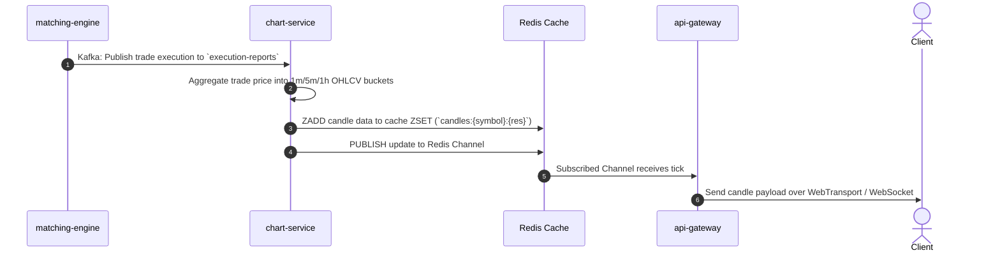

# Perpetuals Exchange Architecture & System Documentation

This repository houses a high-performance, transactionally safe, real-time microservices-based perpetuals exchange. The system is designed with a segregated write-path (leveraging Kafka event streaming) and a read-path (leveraging gRPC and Redis caching).

---

## 1. System Overview & Microservices

The exchange consists of 9 microservices, each built in Rust:

1. **`api-gateway`**: The public entry point. Handles REST requests, WebSocket (WS), and WebTransport (WT) connections. Subscribes client streams directly to Redis PubSub.
2. **`trading-service`**: Handles order creation, cancellation, and tracks user positions.
3. **`account-service`**: Manages user balances and frozen margins. Employs row-level database locking (`FOR UPDATE`) to ensure absolute safety.
4. **`matching-engine`**: An in-memory B-Tree orderbook. Matches orders sequentially and publishes fills.
5. **`risk-engine-service`**: Calculates unrealized PnL, mark prices, monitors position health, and triggers liquidations when margin drops below **0.5% MMR**.
6. **`chart-service`**: Aggregates real-time trades into OHLCV candlestick bars and caches them in Redis ZSETs while writing to a TimescaleDB hypertable.
7. **`oracle-aggregator`**: Streams external prices from Binance & Coinbase WebSockets to calculate a consolidated Index Price.
8. **`binance-liquidation`**: Subscribes to Binance's live liquidation stream to publish liquidations for market tracking.
9. **`market-service`**: Stores static market metadata (min/max size, tick sizes, etc.).

---

## 2. Microservice Communication Matrix

The exchange uses a hybrid communication model tailored for performance and safety:

| Source Service | Target Service | Protocol | Purpose |
| :--- | :--- | :--- | :--- |
| `api-gateway` | `trading-service` | REST/gRPC | Submit/Cancel orders, query open positions |
| `api-gateway` | `account-service` | REST/gRPC | Fetch user balances, deposit/withdraw |
| `api-gateway` | `chart-service` | REST/gRPC | Pull historical candles |
| `trading-service` | `account-service` | gRPC | Lock/release/adjust margins on order placement and fills |
| `trading-service` | `market-service` | gRPC | Validate symbol metadata |
| `trading-service` | `risk-engine-service` | gRPC | Check position health before placing order |
| `risk-engine-service` | `account-service` | gRPC | Adjust balances (Funding fees, Bankruptcy/Insurance transfers) |

---

## 3. Kafka Topics & Event Streams

Kafka acts as our asynchronous event backbone, decoupling the transaction paths.

| Topic Name | Producer(s) | Consumer(s) | Message Payload Structure |
| :--- | :--- | :--- | :--- |
| **`order-events`** | `trading-service` | `matching-engine` | `id`, `user_id`, `symbol`, `side`, `order_type`, `price`, `quantity`, `action` ("CREATE"/"CANCEL") |
| **`execution-reports`** | `matching-engine` | `trading-service`, `risk-engine-service`, `chart-service` | `id`, `symbol`, `maker_order_id`, `taker_order_id`, `maker_user_id`, `taker_user_id`, `price`, `quantity`, `taker_side` |
| **`price-feed`** | `oracle-aggregator` | `risk-engine-service` | `symbol`, `index_price`, `mark_price`, `timestamp` |
| **`liquidations`** | `risk-engine-service` | `trading-service`, `risk-engine-service` | `position_id`, `user_id`, `symbol`, `side`, `margin` |

---

## 4. Key Transaction Flows

### Flow A: Place Order Flow
This flow handles the placement of a new limit order, showing how margin locking is decoupled from order execution:

```mermaid
sequenceDiagram
    autonumber
    actor Client
    participant Gateway as api-gateway
    participant Trading as trading-service
    participant Account as account-service
    participant Engine as matching-engine

    Client->>Gateway: POST /api/v1/orders
    Gateway->>Trading: gRPC: CreateOrder()
    
    rect rgb(30, 41, 59)
        Note over Trading, Account: Sage Phase 1: Margin Locking
        Trading->>Account: gRPC: LockMargin(amount = size * price / leverage)
        Account-->>Trading: Success (Balance locked in database)
    end

    Trading->>Trading: Insert Order into DB (Status = PENDING)
    Trading->>Engine: Kafka: Publish to `order-events`
    Trading-->>Gateway: Order ID & Status = OPEN
    Gateway-->>Client: Returns JSON response
    
    rect rgb(15, 23, 42)
        Note over Engine, Trading: Async Execution Path
        Engine->>Engine: Process match in B-Tree Book
        Engine->>Trading: Kafka: Publish trade/fill to `execution-reports`
        Trading->>Trading: Update Order DB (Status = FILLED)
        Trading->>Account: gRPC: ReleaseMargin() & AdjustMargin(Realized PnL)
    end
```

---

### Flow B: Automatic Liquidation Waterfall
This flow showcases how a bankrupt position is liquidated, executed against the orderbook, and protected by the Insurance Fund:

```mermaid
sequenceDiagram
    autonumber
    participant Oracle as oracle-aggregator
    participant Risk as risk-engine-service
    participant Trading as trading-service
    participant Engine as matching-engine
    participant Account as account-service

    Oracle->>Risk: Kafka: Publish price tick to `price-feed`
    Risk->>Risk: Evaluates: Margin Balance < Maintenance Margin (0.5%)
    Risk->>Trading: Kafka: Publish user details to `liquidations`
    
    rect rgb(45, 15, 15)
        Note over Trading, Engine: Market Kill Order Routing
        Trading->>Trading: Identify position size and opposite side
        Trading->>Engine: Kafka: Publish MARKET order to `order-events`
    end

    Engine->>Engine: Execute Market Order against live Bids/Asks
    Engine->>Trading: Kafka: Publish fill details to `execution-reports`

    rect rgb(30, 41, 59)
        Note over Trading, Account: Bankruptcy Settlement (Insurance Fund Payout)
        Trading->>Account: gRPC: Release remaining margin
        alt Final Balance is Negative (Deficit)
            Trading->>Account: gRPC: Deduct deficit from global INSURANCE_FUND
            Trading->>Account: gRPC: Inject deficit to bankrupt account (balance = $0)
        else Final Balance is Positive (Clearance Fee)
            Trading->>Account: gRPC: Deduct remaining balance and inject into INSURANCE_FUND
        end
    end
```

---

### Flow C: Real-Time Candlestick Feed
This flow details how candle feeds make their way from trades to client screens:

---

